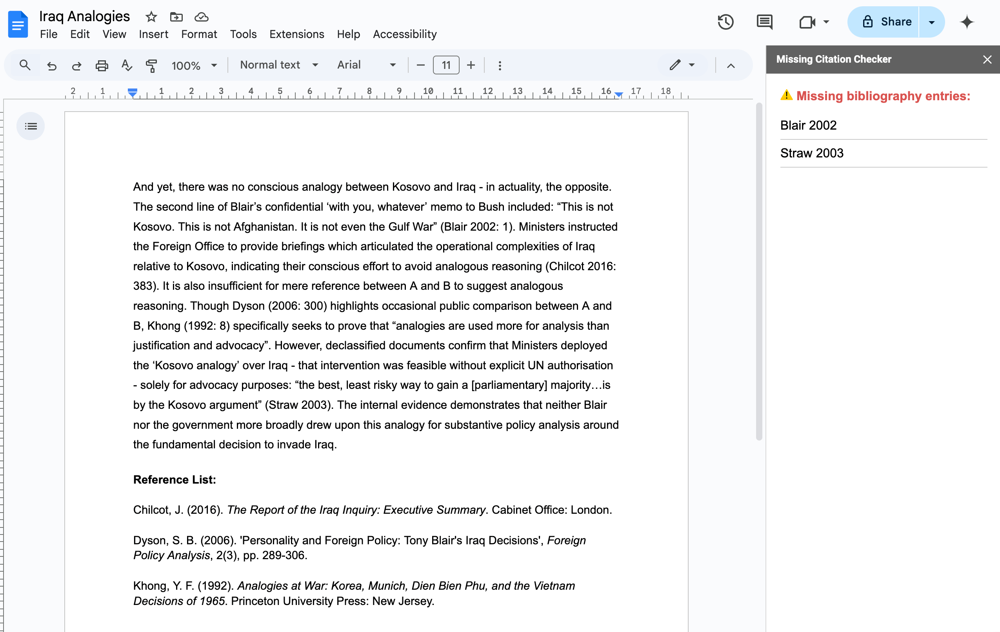

# Missing Citation Checker

**Missing Citation Checker** is a simple Google Docs add-on that scans a document to ensure that the in-text citations and the final reference list align. In other words, no more submitting an essay then realising that a citation didn't make it into your bibliography!

## Instructions

1. Write your essay and include your bibliography and reference list in the same document.  
2. Navigate to `Extensions > Check citations`.  
3. The tool will inform you if any citations are missing.

#### Example

> “Tony Blair (2010: 268) writes that ‘criminal justice was altogether a different bag of nails’ — an analysis supported by numerous scholars (Rowling 2002; Sinja et al. 2010).”
>
> **References:**
>
> - Blair, T. (2010). *A Journey*. Penguin Books: London.  
> - Rowling, M. (2002). ‘Analysis of Criminal Justice Policy’, *Law Review*, 23(2), pp. 220–234.

In this scenario, **“Sinja et al. 2010”** would be flagged as an incomplete entry because it is an in-text citation excluded from the final reference list. The tool’s purpose is not to correct the bibliography, but simply to identify such issues which can be manually addressed by the author.

## Terms of Service

This tool is intended as a final check before submitting an essay, but it may not catch every anomaly and should not be treated as a replacement for any manual review. It cannot be held liable for any inaccuracies arising from its use.

## Privacy Policy

No user data or content is collected or stored. Access to the user’s document is requested solely to enable the tool’s function and is not retained.

## Support

If you have any questions or issues, please feel free to create an issue on this GitHub repository or email `contact@clubpenguinmountains.com`.

